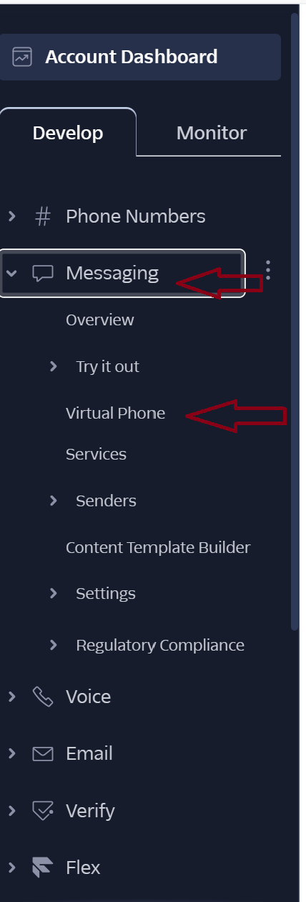

# Batchable - Developer Documentation

## 1. How to Obtain the Source Code
To obtain the Batchable source code, clone the main repository from GitHub using git clone. All system components, including the backend, frontend, documentation, and configuration files, are contained within this single repository. Developers should then create a new feature branch for changes they would like to make before beginning development.

If environment variables are required such as API keys, they should be added to the `vars.env` file located in the project root. These values should never be committed to version control.

### Editor/Git Configuration
To contribute to the source code in a similar manner to the existing codebase, please install an [EditorConfig](https://editorconfig.org/) extension/plug-in for your editor so as to use our global `.editorconfig` settings and not mess up spacing, indentation, or line endings. If you're on Windows, please also use Git's `autocrlf=false` option, which is likely not enabled. If it's not, you can use:
```bash
$ git config --global autocrlf false
```

## 2. The Directory Structure
The repository is organized into three primary components: `infra/`, `frontend/`, and `backend/`. Each component has a clearly defined responsibility within the system architecture.

In short, their functions are as follows:
* `infra/`: database configuration
* `frontend/`: the React front-end code and tests
  * `app/`: the front-end implementation (components, API wrappers)
  * `test/` the front-end tests; mirrors the structure of `app/`.
* `backend/`: the Spring Boot back-end code and tests
  * `src/main/java/com/batchable/backend/`: the back-end implementation (HTTP endpoints, database wrappers)
  * `src/test/java/com/batchable/backend/`: the back-end tests

The `infra/` directory contains the infrastructure and database configuration for the system. This section handles the creation, initialization, and maintenance of the PostgreSQL database using SQL files. It defines schema setup, table creation, and any required database configuration necessary for the backend to operate correctly.

The `frontend/` directory contains the client-side application and its associated tests. The main application code is located under `frontend/app/`. Within this directory, the application is structured as follows: `api/` contains frontend API wrappers that communicate with the backend, `components/` contains reusable UI components, domain/ defines shared types and domain-level logic, routes/ contains route-level pages and navigation logic, and `util/` stores general utility functions used throughout the frontend. Static assets are located under `frontend/public/`. Frontend tests are located under `frontend/test/` and follow the structure of the application layer (`/app`).

The `backend/` directory contains the server-side application implemented in Java. The primary source code resides in `backend/src/main/java/com/batchable/backend`. This layer contains the core application components, including the controllers that define HTTP endpoints, the services layer that implements business logic, and the database manager responsible for interacting with the persistence layer, the Twilio manager which sends SMS notifications to drivers when new delivery batches are assigned, the websocket which handles communication with the frontend, client and models which handle the Google API, and the batching algorithm and manager which handles orchestration of batching.

## 3. How to Build and Run the Software

### Prerequisites
First, ensure that the prerequisite software is installed on your system. Then ensure that Docker is currently running: Running `docker` in a terminal indicate that Docker is active.
* Maven
* Java 17
* Node.js 22+
* npm 11+
* Docker Desktop

## Installation
If this is your first time building the code, you will need to complete the following steps:
1. Clone the source code:
  ```bash
  git clone https://www.github.com/zgodil/cse403-batchable.git
  ```
2. If a `vars.env` file is not provided, create a file named `vars.env` in the root of the cloned project and place the provided credentials inside it. Otherwise, simply place the provided `vars.env` file in the root of the project. *Important: do not place your environment variables in the file called `.env`. To successfully complete setup, both `.env` and `vars.env` should be present in the project's root directory*.

### vars.env Credentials

The values required in `vars.env` will be **provided by the development team** for the purposes of running the system. 

The structure of `vars.env` should be as follows:
```sh
TWILIO_ACCOUNT_SID=
TWILIO_AUTH_TOKEN=
TWILIO_PHONE_NUMBER=
TWILIO_DRIVER_PHONE_NUMBER=
GOOGLE_ROUTES_API_KEY=
LOCATION_PROTOCOL=http
LOCATION_HOST=localhost
LOCATION_PORT=5173
```

Below is an explanation of each variable:

The Twilio variables configure SMS notifications for drivers:
* `TWILIO_ACCOUNT_SID` – Twilio account SID
* `TWILIO_AUTH_TOKEN` – Twilio auth token
* `TWILIO_PHONE_NUMBER` – the number Twilio will use as the sender
* `TWILIO_DRIVER_PHONE_NUMBER` – the phone number used during development and testing to receive SMS notifications. Because the system uses a Twilio trial account, messages are sent only to this verified number rather than to the individual driver phone numbers entered in the system.

The Google variable configures routing calculations:
* `GOOGLE_ROUTES_API_KEY` – Google Routes API key for delivery route optimization and distance calculations

**Additional information**
- Twilio trial accounts can only send to verified numbers, so a single configured number simplifies testing
- The system sends an SMS notification to `TWILIO_DRIVER_PHONE_NUMBER` whenever a new delivery batch is assigned to a driver.

## Build & Run
Then, while still in the root, execute the following in an **sh-compatible** terminal:

```bash
# in project root
./build.sh
./run.sh
```

Then, visit http://localhost:5173.

**Note for Mac and Linux:** The above may not work, as you need to give permissions to the build scripts. This can be done as follows:
```bash
# mac & linux only
chmod +x ./vars.env
chmod +x ./run.sh
chmod +x ./build.sh
```
After giving permissions, retry running the build scripts.

**Troubleshooting:** By far the most common issue is stale database configuration after upgrading Batchable versions. If you encounter issues when running the app for a second time on the same machine, try running `npm run db:reset` in the project root. Also make sure that your vars.env file is up to date.

## 4. How to test the software

### Front-End
To run the frontend tests locally, after running `./build.sh` in the root of the project, run `npm test` from within the `frontend` folder. This will run all tests and, if successful, print a code coverage report after completion.

To get a prettier view of the testing infrastructure, run `npm test -- --ui` instead, which will provide a link (with a 5-ish digit port number) to view live test results. Very detailed code coverage information can be found via an icon in the upper right of the left panel of the Vitest Web UI.

If you want to manually experiment with the front-end without creating a production build (`./build.sh`), you can run `npm run dev` in the `frontend/` folder to see the UI wrapped around a lightweight mock of the back-end.

### Back-End
To run the backend tests/code coverage, first ensure Docker says "engine is running" and there is a container named `cse403-batchable`. If there is no container, do `./build.sh` and `./run.sh` from the root to run the server, then once it starts, stop it with `ctrl-c`. This should create the container. Once Docker is running with the necessary container, navigate to the backend directory (`cd backend` from root). Make sure the terminal has the context of the secret variables. This can be achieved by taking each line of vars.env, copying it into the terminal, prepending it with "EXPORT ", and entering it. Finally, to run the tests, do `./mvnw clean test`. To view the backend code coverage, do `./mvnw clean verify` and look for coverage results in `backend/target/site/jacoco/index.html`.

To see test results (and code coverage information) in the GitHub CI, look into the CI run details for the "Frontend CI / Build", and look under the step "Run Tests". This will show the code coverage report, or test failure reasons. PRs with under 70% branch and statement coverage for the front end should not be merged (unless those branches can be reasonably be shown to be impossible but required by the style guide), and new features need to adhere to these guidelines.

## 5. How to Add New Tests

### Front-End
To add a new test to the front-end, simply add a new file within frontend/test, ending in .spec.ts for normal unit tests or .spec.tsx for component and UI tests. If the feature you are testing is related to a specific file within frontend/app, place your testing file in the same place relative to frontend/test (e.g. tests for frontend/app/components/Modal.tsx should be in frontend/test/components/Modal.spec.tsx).

Almost every new test will need imports from our testing frameworks: Vitest and React Testing Library.

```ts
import {describe, it, expect} from 'vitest';
import {render, screen} from '@testing-library/react';
```

We follow the typical patterns for these tools, whose documentation websites can be found [here for Vitest](https://vitest.dev) and [here for RTL](https://testing-library.com/docs/react-testing-library/intro/) like the rest of the front-end, please follow the [Google TypeScript Style Guide](https://google.github.io/styleguide/tsguide.html).

#### Miscellaneous Front-End Testing Advice
The following facts may be useful when performing common tasks in front-end testing. Don't re-invent the wheel!
* Re-usable mock domain objects (`Order`s, `Driver`s, etc.) can be found in `frontend/test/mocks/domain_objects.ts`.
* Due to our mocking system, back-end API calls can be made using the normal interfaces (`restaurantApi`, `orderApi`, etc.).
* When unit-testing a component which loads data with `useLoader()`, import `frontend/test/mocks/query.ts` at the top of the testing file. It provides utilities for safely using data fetching within the React Testing Library.

### Back-End
To add a new test to the back-end, create a new test file under backend/src/test/java/ that mirrors the package structure of the file being tested.

Test classes should follow the naming convention:
* `ClassNameTest.java` for unit tests
* `ClassNameIT.java` for integration tests and have them not trigger the CI
* `ClassNameIT_CI.java` for integration tests and to have them add to the CI for GitHub

Backend tests are written using JUnit and Mockito. We follow standard JUnit testing patterns. Unit tests should isolate business logic in: Services, the Batching Algorithm, the Batching Manager, and the Database Manager. 

Controller tests should verify HTTP behavior and response correctness. When testing components that depend on external services such as Twilio, those services should be mocked rather than invoked directly, unless the test is specifically designed to check integration with the actual service.

#### Database Interaction
If a test requires database interaction, ensure the database is running before executing integration tests. All new backend features must include corresponding tests before being merged into main. Please follow existing test structure and naming conventions for consistency.

#### Twilio Interaction
When testing `TwilioManager` or other components that call Twilio, mock the `RestClient` and `Message.creator()` calls to avoid sending real SMS. Existing test patterns are demonstrated in `backend/src/test/java/com/batchable/backend/twilio/`.

## 6. How to Build a Release of the Software
Releases must be built from the main branch after all changes have been merged and validated. Before building a release, developers must ensure that all backend and frontend tests pass and that the application runs successfully in a local development environment.

Prior to packaging the release, update the version in the documentation.

### Deployment
Once the code for the new version is on main, you can deploy the new code using the following steps:
1. Run `ssh root@batchable.org`, and enter the password.
2. `cd server/cse403-batchable`
3. `chmod +x ./deploy.sh && ./deploy.sh`
4. You're done! This may take a few minutes before the server finishes restarting. You can view the result at [batchable.org](https://batchable.org)

## 7. Accessing the Twilio Virtual Phone (Testing SMS)

Because the system currently uses a **Twilio trial account**, SMS messages cannot be sent to arbitrary phone numbers. Instead, all driver SMS notifications are delivered to a **Twilio virtual phone interface** that can be viewed in the Twilio console.

To view incoming SMS messages, follow these steps:

1. Navigate to the Twilio login page:  
   https://www.twilio.com/login

2. Log in using the Twilio credentials provided by the development team.

3. After entering the username and password, you will be prompted for **two-factor authentication**.

4. Select **“Try another method”** and enter the **one-time login code** provided by the development team.  
   - This code changes each time a new login occurs.
   - A new code will be generated after logging in and should be stored for the next login session.

5. After successfully logging in, you will see the **Twilio Console dashboard**.

6. In the left navigation panel:
   - Click **Messaging**
   - Then click **Virtual Phone**



Alternatively, you can navigate directly to the page:
https://console.twilio.com/us1/develop/sms/virtual-phone

7. On the Virtual Phone page, locate the **phone number selector** near the top right of the interface.

8. Click the dropdown menu and select the **available phone number** (there is currently only one configured number).

Once selected, the interface will display all SMS messages sent by the Batchable system. When a new delivery batch is assigned to a driver, the system will send a message that appears here.

### Message Format

The SMS message is formatted in the following order:
- Driver name
- Batch ID
- A link to the driver's route page

Example: Driver John (id 42) you have been assigned a new batch. View here ___


